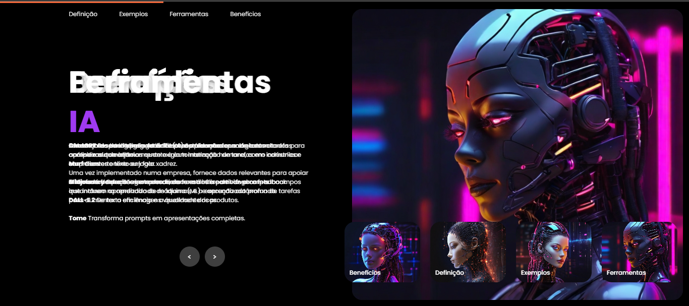
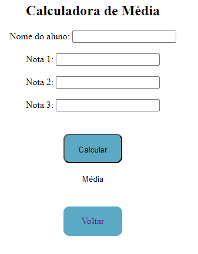
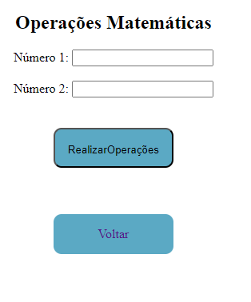
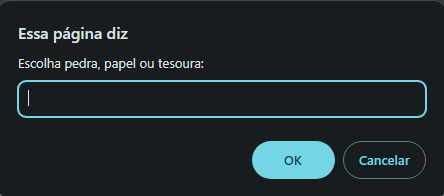
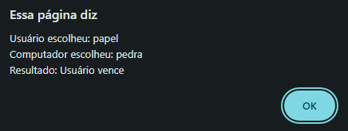
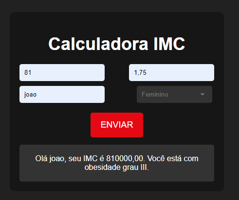

# TAPWM

# Repositório de Projetos Acadêmicos

Bem-vindo ao repositório de entrega de pequenos projetos acadêmicos em JavaScript e C#! Este repositório foi criado para armazenar e compartilhar diversos projetos desenvolvidos durante o curso.

## Índice

- [Descrição](#descrição)
- [Projetos](#projetos)
- [Como Contribuir](#como-contribuir)
- [Licença](#licença)

## Descrição

Este repositório contém uma coleção de projetos acadêmicos desenvolvidos em JavaScript e C#. Cada projeto aborda diferentes conceitos e técnicas aprendidas durante o curso.

## Projetos

### JavaScript

1. **ATV2**: Pesquisa acadêmica na internet sobre o tema de Inteligência Artificial, abordando os principais conceitos, avanços e aplicações.
2. **ATV3**: Mini projeto de uma landing page que apresenta o conteúdo da pesquisa de Inteligência Artificial, utilizando HTML, CSS e JavaScript para uma apresentação interativa e informativa.
   

   
📸

   

   

3. **ATV6**: Introdução ao aprendizado em JavaScript com dois exemplos práticos que demonstram a aplicação da linguagem.

  
📸

4. **ATV7**: Jogo de Pedra, Papel e Tesoura implementado em JavaScript, onde o usuário pode jogar contra a máquina.

  
📸 

5. **ATV8**: Formulário de pesquisa para coletar opiniões, idades e contabilizar o total de homens e mulheres participantes.

  
📸

6. **ATV9**: Calculadora de IMC (Índice de Massa Corporal) que permite ao usuário inserir altura e peso para calcular e exibir o resultado.

  
📸

7. **ATV10**: Aplicação que solicita o tamanho dos lados de um triângulo e classifica-o como isósceles, escaleno ou equilátero.

  
📸

### C#

1. **ATV4**: Início de um projeto utilizando a abordagem de programação baseada em classes (Pclasse), com o objetivo de entender a estrutura e a utilização de classes e objetos em C#.

  
📸

2. **ATV5**: Finalização do projeto Pclasse, implementando uma aplicação prática utilizando Windows Forms para criar uma interface gráfica de usuário (GUI).

  
📸

  
  

## Como Contribuir

Se você deseja contribuir para este repositório, siga os passos abaixo:

1. Faça um fork deste repositório.
2. Crie uma branch para sua feature (`git checkout -b feature/sua-feature`).
3. Commit suas mudanças (`git commit -am 'Adiciona nova feature'`).
4. Faça um push para a branch (`git push origin feature/sua-feature`).
5. Crie um Pull Request.

## Licença

Este projeto está licenciado sob a [MIT License](LICENSE.txt).

---

Sinta-se à vontade para explorar os projetos e contribuir com melhorias e novas ideias. Qualquer dúvida, entre em contato!
